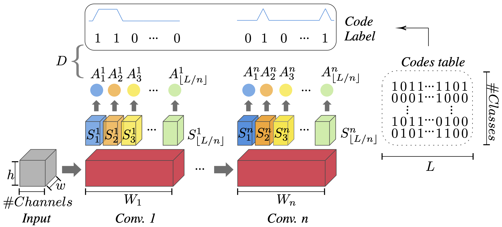
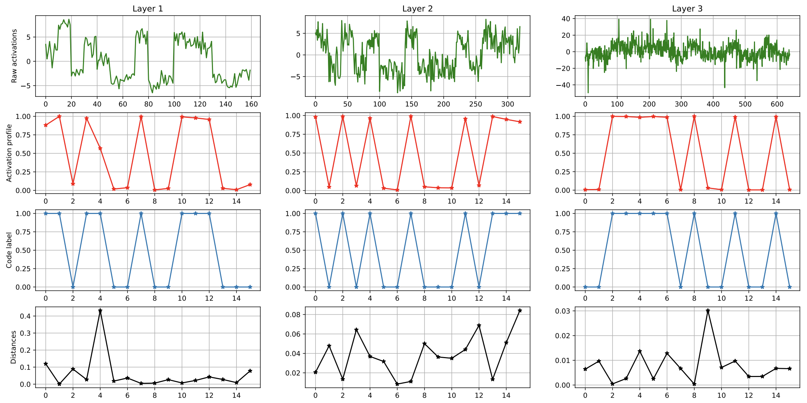

# Total Activation Classifiers

This repo contains an implementation of training for a subset of models reported in our ICLR 2023 paper: [Constraining Representations Yields Models That Know What They Don't Know](https://openreview.net/pdf?id=1w_Amtk67X).

## Models summary

Total activation classifiers, or TAC for short, operate by defining class-dependent activation patterns - referred to a *class codes* -  that must be followed by each layer of a multi-layer classifier. Those patterns are decided a priori and designed to be maximally separated.

In doing so, one can make predictions by checking for the best match between an observed activation pattern and the set of codes used for training. In addition, one can can use the goodness of match between observed activation profiles and known codes as a confidence score to define selective classifiers able to reject when uncertain.

An illutration of the model is provided below. TACs relying on a multi-layer classifier (pre-trained or not) and extract poolled/lower-dimensional activation profiles via a project-slice-sum sequence of operations. The projection layers are trained, while the layers of the base classifier may or may not be trained.



We observed TACs to e able to match class codes very well while attaining accuracy on par with the base classifier, all the while offering the possbility to perform selective classification or reject likely OOD samples. We also observed improved adversarial robustness. See below for a goodness-of-match plot of activation profiles and a class code for a test CIFAR-10 image.



# Using this codebase

After installing requirements, one can launch training experiments using the launcher script provided at the root of this repo. The `-e` argument can be set to `mnist` or `cifar10`.

Experiment configurations cen be setup in the `exp_configs.py` file.

Adversarial training can be performed vi passing an attacker config via the `attacker_config` option, with example configs provided in that file. Also, pre-trained or random base classifiers can be used via different setting of `pretrained_path`.

# Citation

```
@inproceedings{
monteiro2023constraining,
title={Constraining Representations Yields Models That Know What They Don't Know},
author={Joao Monteiro and Pau Rodriguez and Pierre-Andre Noel and Issam H. Laradji and David Vazquez},
booktitle={The Eleventh International Conference on Learning Representations },
year={2023},
url={https://openreview.net/forum?id=1w_Amtk67X}
}
```
